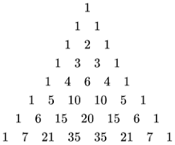

# Exercises Re02

> You must start by downloading the script
>
> [download_re02.py](download_scripts/download_re02.py)
>
> Right-click and select “Save link as…”
> Run this script in VSCode to download the files you need for today's exercise. The script does not need to be located a specific place on your computer.

The following exercises are not all supposed to be completed today. This is a collection of exercises that you can use to practice your skills on your own as well, but all of the TA's are more than capable of helping you with it.

This week there are 13 exercises.  The exercises are divided into 2 parts, the first part is normal exercises to practice your skills (1-10). The second part is a similar to the exam, where you have to write a function that solves a specific problem (11-13).

If you have any questions, feel free to ask. Send an email to [s194113@dtu.dk](matilto:s194113@dtu.dk?subject=02002_Brush_Up_Course).

## Exercise 2.1: Simulate Collision

Complete the function called `simulate_motion` that takes four parameters: `v1` and `v2`; The initial speeds of the cars, and `x1` and `x2`; The initial positions of the cars. This function should return one of two strings: If the cars at any time in the future would collide, return a string that states `"The objects will collide at time x seconds."`, where `x` is the time it would take. If the cars wouldn't collide, it should return the string `"The objects will never collide."`.

Please use what you have learned in Physics to solve this question. If in doubt, the position of a car with a given initial speed and position is:

$$
x(t)= x_0 + v_0*t
$$

```python
>>> simulate_motion(1, 2, 3, 6)
The objects will never collide.
>>> simulate_motion(3,4,5)
The objects will collide at time 3.0 seconds.
```

The tests for the function ``simulate_motion`` can be run by inserting your solution into the file ``cp/re02/physics``.

__cp.re02.physics.simulate_motion(_v1_,_v2_,_x1_,_x2_)__

&nbsp;&nbsp;&nbsp;&nbsp;&nbsp;&nbsp;Simulate the motion of two objects. Tell when they will collide.

> &nbsp;&nbsp;&nbsp;&nbsp;&nbsp;&nbsp;  Parameters 
> &nbsp;&nbsp;&nbsp;&nbsp;&nbsp;&nbsp;&nbsp;&nbsp;&nbsp;&nbsp;&nbsp;&nbsp; - __v1__ (``float``) - the velocity of the first object 
> &nbsp;&nbsp;&nbsp;&nbsp;&nbsp;&nbsp;&nbsp;&nbsp;&nbsp;&nbsp;&nbsp;&nbsp; - __v2__ (``float``) - the velocity of the second object 
> &nbsp;&nbsp;&nbsp;&nbsp;&nbsp;&nbsp;&nbsp;&nbsp;&nbsp;&nbsp;&nbsp;&nbsp; - __x1__ (``float``) - the initial position of the first object 
> &nbsp;&nbsp;&nbsp;&nbsp;&nbsp;&nbsp;&nbsp;&nbsp;&nbsp;&nbsp;&nbsp;&nbsp; - __x2__ (``float``) - the initial position of the second object 
> &nbsp;&nbsp;&nbsp;&nbsp;&nbsp;&nbsp;  Returns 
> &nbsp;&nbsp;&nbsp;&nbsp;&nbsp;&nbsp;&nbsp;&nbsp;&nbsp;&nbsp;&nbsp;&nbsp; - __string__ (``string``) - When and if the objects will collide

## Exercise 2.2: Dictionary of strings

Complete the function `dictionary_length` that takes a list `l` of strings and returns a dictionary, `d`, that has the strings as keys and the length of the strings as the value.

```python
>>> dictionary_length(["hello", "world", "python", "programming", "language"])
{'hello': 5, 'world': 5, 'python': 6, 'programming': 11, 'language': 8}
>>> dictionary_length(['a', 'ab', 'abc', 'abcd'])
{'a': 1, 'ab': 2, 'abc': 3, 'abcd': 4}
```

The tests for the function ``dictionary_length`` can be run by inserting your solution into the file ``cp/re02/dictionary1``.

__cp.re02.permutations.permutations(_s_)__

&nbsp;&nbsp;&nbsp;&nbsp;&nbsp;&nbsp; Given a list of strings, return a dictionary with the length of each string as values and the strings as keys.

> &nbsp;&nbsp;&nbsp;&nbsp;&nbsp;&nbsp;  Parameters 
> &nbsp;&nbsp;&nbsp;&nbsp;&nbsp;&nbsp;&nbsp;&nbsp;&nbsp;&nbsp;&nbsp;&nbsp; - __l__ (``list``) - list of words 
> &nbsp;&nbsp;&nbsp;&nbsp;&nbsp;&nbsp;  Return 
> &nbsp;&nbsp;&nbsp;&nbsp;&nbsp;&nbsp;&nbsp;&nbsp;&nbsp;&nbsp;&nbsp;&nbsp; - __d__ (``dict``) - dictionary with words as keys and lengths as values \

## Exercise 2.3: Dictionary of strings 2

Complete the function `dictionary_lengths` that takes a list `l` of strings and returns a dictionary, `d`, that has the lengths as the keys, and a list of all strings in `l` with that length as the value.

```python
>>> dictionary_length(["hello", "world", "python", "programming", "language"])
{5: ['hello', 'world'], 6: ['python'], 11: ['programming'], 8: ['language']}>>> dictionary_length(['a', 'ab', 'abc', 'abcd'])
{1: ["a"], 2: ["ab"], 3: ["abc"], 4: ["abcd"]}
```

The tests for the function ``dictionary_lengths`` can be run by inserting your solution into the file ``cp/re02/dictionary2``.

__cp.re02.permutations.permutations(_s_)__

&nbsp;&nbsp;&nbsp;&nbsp;&nbsp;&nbsp; Given a list of strings, return a dictionary with the length of each string as keys and a list of strings with that length as the value.

> &nbsp;&nbsp;&nbsp;&nbsp;&nbsp;&nbsp;  Parameters 
> &nbsp;&nbsp;&nbsp;&nbsp;&nbsp;&nbsp;&nbsp;&nbsp;&nbsp;&nbsp;&nbsp;&nbsp; - __l__ (``list``) - list of words 
> &nbsp;&nbsp;&nbsp;&nbsp;&nbsp;&nbsp;  Return 
> &nbsp;&nbsp;&nbsp;&nbsp;&nbsp;&nbsp;&nbsp;&nbsp;&nbsp;&nbsp;&nbsp;&nbsp; - __d__ (``dict``) - dictionary with words as values and lengths as keys \

## Exercise 2.4: Palindrome Check

Complete the function `is_palindrome` that takes a string `s` and returns `True` if the string is a palindrome, and `False` otherwise. A palindrome is a word, phrase, number, or other sequence of characters that reads the same forward and backward. Your function should ignore any non-alphanumeric characters and should be case-insensitive.

```python
>>> is_palindrome('abba')
True
>>> is_palindrome('abab')
False
```

The tests for the function ``is_palindrome`` can be run by inserting your solution into the file ``cp/re02/palindrome``.

__cp.re02.palindrome.is_palindrome(_s_)__

&nbsp;&nbsp;&nbsp;&nbsp;&nbsp;&nbsp; Return True if the input string is a palindrome, False otherwise.

> &nbsp;&nbsp;&nbsp;&nbsp;&nbsp;&nbsp;  Parameters 
> &nbsp;&nbsp;&nbsp;&nbsp;&nbsp;&nbsp;&nbsp;&nbsp;&nbsp;&nbsp;&nbsp;&nbsp; - __s__ (``str``) - string 
> &nbsp;&nbsp;&nbsp;&nbsp;&nbsp;&nbsp;  Return 
> &nbsp;&nbsp;&nbsp;&nbsp;&nbsp;&nbsp;&nbsp;&nbsp;&nbsp;&nbsp;&nbsp;&nbsp; - __b__ (``bool``) - True or False if palindrome or not \

## Exercise 2.5: Pascals Triangle

Complete the function `pascals_triangle` that takes a positive integer `n` and returns a list of elements on the nth row of pascals triangle.

Pascal's triangle is made by summing the two numbers above it self (see the figure below). This means that if the two numbers above are 1 and 1, the number below will become 2. The number on the edges is always 1.



```python
>>> pascals_triangle(1)
[1, 1]
>>> pascals_triangle(3)
[1, 3, 3, 1]
```

The tests for the function ``pascals_triangle`` can be run by inserting your solution into the file ``cp/re02/pascals_triangle``.

__cp.re02.pascals_triangle.pascals_triangle(_n_)__

&nbsp;&nbsp;&nbsp;&nbsp;&nbsp;&nbsp; Return Pascal's nth row.

> &nbsp;&nbsp;&nbsp;&nbsp;&nbsp;&nbsp;  Parameters 
> &nbsp;&nbsp;&nbsp;&nbsp;&nbsp;&nbsp;&nbsp;&nbsp;&nbsp;&nbsp;&nbsp;&nbsp; - __n__ (``int``) - line number to generate 
> &nbsp;&nbsp;&nbsp;&nbsp;&nbsp;&nbsp;  Return 
> &nbsp;&nbsp;&nbsp;&nbsp;&nbsp;&nbsp;&nbsp;&nbsp;&nbsp;&nbsp;&nbsp;&nbsp; - __l__ (``list``) - list of numbers in the nth row of pascals triangle.

## Exercise 2.6: Matrix Calculation 1

Complete the function `calc_matrix` that takes a list of lists (representing a matrix), `m`, and an axis `n` (either 0 or 1) and returns the sum of `m` along this axis. Fx. a matrix like the one below has axis 0 along the horizontal (rows), while axis 1 is along the vertical (columns).

$$
(0:\ \rightarrow \ \ \  1:\  \downarrow) \ \ \ \ \ \ \
\left(\begin{array}{ccc}
1 & 2 & 3\\
4 & 5 & 6\\
7 & 8 & 9\\
\end{array}\right)
$$

Thus the sum along axis 0 is [6, 15, 24] and along axis 1 it is [12, 15, 18]. Along with this: if the list of lists is not rectangular (fx. first list contains 1 element, while the second one contains 3: `[[1], [2,3,5]]`) the function should return `The matrix is not rectangular.`. Also if the axis is not defined to be 0 or 1, the function should return `The axis must be 0 or 1.`

```python
>>> m = [[1,2,3],[4,5,6],[7,8,9]]
>>> n = 0
>>> result = calc_matrix(m,n)
[6, 15, 24]
>>> n = 1
>>> result = calc_matrix(m,n)
[12, 15, 18]
```

The tests for the function ``calc_matrix`` can be run by inserting your solution into the file ``cp/re02/matrix1``.

__cp.re02.matrix1.calc_matrix(_m_,_n_)__

&nbsp;&nbsp;&nbsp;&nbsp;&nbsp;&nbsp; Calculate the sum of a matrix along an axis. Make sure the matrix is rectangular.

> &nbsp;&nbsp;&nbsp;&nbsp;&nbsp;&nbsp;  Parameters 
> &nbsp;&nbsp;&nbsp;&nbsp;&nbsp;&nbsp;&nbsp;&nbsp;&nbsp;&nbsp;&nbsp;&nbsp; - __m__ (``list``) - a list of lists of integers. 
> &nbsp;&nbsp;&nbsp;&nbsp;&nbsp;&nbsp;&nbsp;&nbsp;&nbsp;&nbsp;&nbsp;&nbsp; - __n__ (``int``) - an integer representing the axis to sum along. 
> &nbsp;&nbsp;&nbsp;&nbsp;&nbsp;&nbsp;  Return 
> &nbsp;&nbsp;&nbsp;&nbsp;&nbsp;&nbsp;&nbsp;&nbsp;&nbsp;&nbsp;&nbsp;&nbsp; - __l__ (``list``) - a list of integers representing the sum of the matrix along the
> &nbsp;&nbsp;&nbsp;&nbsp;&nbsp;&nbsp;&nbsp;&nbsp;&nbsp;&nbsp;&nbsp;&nbsp;&nbsp;&nbsp;&nbsp;&nbsp;&nbsp;&nbsp;&nbsp;&nbsp;&nbsp;&nbsp;&nbsp;&nbsp;&nbsp;&nbsp;&nbsp;&nbsp;&nbsp;&nbsp;&nbsp;&nbsp;specified axis.

## Exercise 2.7: Matrix Calculation 2: Gauss Jordan

Complete the function `gauss_jordan_elimination` that takes a list of lists of integers `m` and returns a list of lists of numbers representing the matrix after Gauss Jordan elimination. The elimination should go through the list of lists like so:

$$
\left(\begin{array}{ccc}
1 & 2 & 3 & 6\\
4 & 5 & 6 & 6\\
9 & 8 & 9 & 6\\
\end{array}\right) \rightarrow
\left(\begin{array}{ccc}
1 & 2 & 3 & 6\\
0 & -3 & -6 & -18\\
0 & -10 & -18 & -48\\
\end{array}\right) \rightarrow
\left(\begin{array}{ccc}
1 & 2 & 3 & 6\\
0 & -3 & -6 & -18\\
0 & 0& 2 & 12\\
\end{array}\right)
$$

And then it should normalize all the equations according to the diagonal:

$$
\left(\begin{array}{ccc}
1 & 2 & 3 & 6\\
0 & -3 & -6 & -18\\
0 & 0& 2 & 12\\
\end{array}\right) \rightarrow
\left(\begin{array}{ccc}
1 & 2 & 3 & 6\\
0 & 1 & 2 & 6\\
0 & 0& 1 & 6\\
\end{array}\right)
$$

This should have been something you had in Math 1a, however if you are in doubt about it, the algorithm should figure out the ratio `R2/R1` between the first non-zero value of each row, then subtract the first row times the ratio from the second row. Then follow this algorithm for the `n` rows. If you are in doubt about the algorithm, please read up on it in here: [Link](https://mat1a.compute.dtu.dk/_assets/06_linearequations.pdf)

```python
>>> m = [[1, 2, 3, 6], [4, 5, 6, 6], [9, 8, 9, 6]]
>>> gauss_jordan_elimination(m)
[[1.0, 2.0, 3.0, 6.0], [-0.0, 1.0, 2.0, 6.0], [0.0, 0.0, 1.0, 6.0]]
>>> m = [[1,3,7],[3,4,11]]
>>> gauss_jordan_elimination(m)
[[1.0, 3.0, 7.0], [-0.0, 1.0, 2.0]]
```

The tests for the function ``gauss_jordan_elimination`` can be run by inserting your solution into the file ``cp/re02/matrix2``.

__cp.re02.matrix2.gauss_jordan_elimination(_m_)__

&nbsp;&nbsp;&nbsp;&nbsp;&nbsp;&nbsp;Perform Gauss Jordan elimination on a matrix.

> &nbsp;&nbsp;&nbsp;&nbsp;&nbsp;&nbsp;  Parameters 
> &nbsp;&nbsp;&nbsp;&nbsp;&nbsp;&nbsp;&nbsp;&nbsp;&nbsp;&nbsp;&nbsp;&nbsp; - __m__ (``list``) - a list of lists of integers representing a matrix. 
> &nbsp;&nbsp;&nbsp;&nbsp;&nbsp;&nbsp;  Return 
> &nbsp;&nbsp;&nbsp;&nbsp;&nbsp;&nbsp;&nbsp;&nbsp;&nbsp;&nbsp;&nbsp;&nbsp; - __m__ (``list``) - a list of lists of integers representing the matrix after Gauss Jordan
> &nbsp;&nbsp;&nbsp;&nbsp;&nbsp;&nbsp;&nbsp;&nbsp;&nbsp;&nbsp;&nbsp;&nbsp;&nbsp;&nbsp;&nbsp;&nbsp;&nbsp;&nbsp;&nbsp;&nbsp;&nbsp;&nbsp;&nbsp;&nbsp;&nbsp;&nbsp;&nbsp;&nbsp;&nbsp;&nbsp;&nbsp;&nbsp;elimination.

## Exercise 2.8: Is it a prime number?

Complete the function called `is_prime` which takes an integer `n` as an input, and outputs a boolean for if the number is prime or not. A hint to solve this is to look and see if the number is divisible by other numbers. Also a small note, 1 is not a prime number, and shouldn't return True.

```python
>>> is_prime(1)
False
>>> is_prime(2)
True
```

The tests for the function ``is_prime`` can be run by inserting your solution into the file ``cp/re02/prime1``.

__cp.re02.prime1.is_prime(_n_)__

&nbsp;&nbsp;&nbsp;&nbsp;&nbsp;&nbsp;Return True if the input number is prime, False otherwise.

> &nbsp;&nbsp;&nbsp;&nbsp;&nbsp;&nbsp;  Parameters 
> &nbsp;&nbsp;&nbsp;&nbsp;&nbsp;&nbsp;&nbsp;&nbsp;&nbsp;&nbsp;&nbsp;&nbsp; - __n__ (``int``) - an integer. 
> &nbsp;&nbsp;&nbsp;&nbsp;&nbsp;&nbsp;  Return 
> &nbsp;&nbsp;&nbsp;&nbsp;&nbsp;&nbsp;&nbsp;&nbsp;&nbsp;&nbsp;&nbsp;&nbsp; - __m__ (``bool``) - a boolean indicating whether the input number is prime.

## Exercise 2.9: Prime factorization

Complete the function `prime_factors`, which takes an integer, and returns a list of prime factors for the number.

```python
>>> prime_factors(12)
[2,2,3]
>>> is_prime(13)
[13]
```

The tests for the function ``prime_factors`` can be run by inserting your solution into the file ``cp/re02/prime2``.

__cp.re02.prime2.prime_factors(_n_)__

&nbsp;&nbsp;&nbsp;&nbsp;&nbsp;&nbsp;Return a list of prime factors of the input number.

> &nbsp;&nbsp;&nbsp;&nbsp;&nbsp;&nbsp;  Parameters 
> &nbsp;&nbsp;&nbsp;&nbsp;&nbsp;&nbsp;&nbsp;&nbsp;&nbsp;&nbsp;&nbsp;&nbsp; - __n__ (``int``) - an integer. 
> &nbsp;&nbsp;&nbsp;&nbsp;&nbsp;&nbsp;  Return 
> &nbsp;&nbsp;&nbsp;&nbsp;&nbsp;&nbsp;&nbsp;&nbsp;&nbsp;&nbsp;&nbsp;&nbsp; - __f__ (``list``) - a list of prime factors of the input number.

## Exercise 2.10: Debounce

Complete the function `debounce` that takes a list, `f` of binary numbers (0 or 1), and an integer `n`. The debounce function should return a list of indices for all the 1s that are followed by `n` 0s. This means that: $ [1,0,0,1] $ should return the index 0 if $n=2$, but not if $n=3$. If there are less then $n$ elements left in the list, all of the rest should be 0s for the list to include the index. If the last value is 1, the list should always include that index.

```python
>>> debounce([0, 1, 0, 0, 1, 1, 0, 0, 0, 1, 0, 0], 2)
[1,5,9]
>>> debounce([0, 1, 0, 0, 1, 1, 0, 0, 0, 1, 0, 0], 3)
[5,9]
```

The tests for the function ``debounce`` can be run by inserting your solution into the file ``cp/re02/debounce``.

__cp.re02.debounce.debounce(_f_,_n_)__

&nbsp;&nbsp;&nbsp;&nbsp;&nbsp;&nbsp;Return a debounced list

> &nbsp;&nbsp;&nbsp;&nbsp;&nbsp;&nbsp;  Parameters 
> &nbsp;&nbsp;&nbsp;&nbsp;&nbsp;&nbsp;&nbsp;&nbsp;&nbsp;&nbsp;&nbsp;&nbsp; - __f__ (``list``) - a binary list. 
> &nbsp;&nbsp;&nbsp;&nbsp;&nbsp;&nbsp;&nbsp;&nbsp;&nbsp;&nbsp;&nbsp;&nbsp; - __n__ (``int``) - an integer. 
> &nbsp;&nbsp;&nbsp;&nbsp;&nbsp;&nbsp;  Return 
> &nbsp;&nbsp;&nbsp;&nbsp;&nbsp;&nbsp;&nbsp;&nbsp;&nbsp;&nbsp;&nbsp;&nbsp; - __l__ (``list``) - a list of indices where the input list f has a debounced value.

## Exercise 2.11: Permutations

Complete the function called `permutations` that takes a string `s`, and returns `perms`, a list of all possible permutations of this string. A permutation is when you shuffle around all of the items in a group. Fx. "ab" has the two permutations "ba" and "ab". Your code should also not include duplicates, such that the only permutation of "bb" is "bb". This function should test your recursive knowledge, and is quite hard.

```python
>>> permutations('aa')
["aa"]
>>> permutations('abc')
['abc', 'acb', 'bac', 'bca', 'cab', 'cba']
```

The tests for the function ``permutations`` can be run by inserting your solution into the file ``cp/re02/permutations``.

__cp.re02.permutations.permutations(_s_)__

&nbsp;&nbsp;&nbsp;&nbsp;&nbsp;&nbsp;Return all possible permutations of a string.

> &nbsp;&nbsp;&nbsp;&nbsp;&nbsp;&nbsp;  Parameters 
> &nbsp;&nbsp;&nbsp;&nbsp;&nbsp;&nbsp;&nbsp;&nbsp;&nbsp;&nbsp;&nbsp;&nbsp; - __s__ (``string``) - initial string 
> &nbsp;&nbsp;&nbsp;&nbsp;&nbsp;&nbsp;  Return 
> &nbsp;&nbsp;&nbsp;&nbsp;&nbsp;&nbsp;&nbsp;&nbsp;&nbsp;&nbsp;&nbsp;&nbsp; - __perm__ (``list``) - the velocity of the first object \

## Exercise 2.12: Search Input Position

Complete the function `search_insert` that takes a _sorted_ list, `nums` of integers, and a target integer `n`. The function should return the index where the number `n` is in the list, or if it is not in the list, should return where it should be in the order.

```python
>>> search_insert([1,3,5,6], 5)
2
>>> search_insert([1,3,5,6], 2)
1
```

The tests for the function ``search_insert`` can be run by inserting your solution into the file ``cp/re02/insert``.

__cp.re02.insert.search_insert(_nums_,_n_)__

&nbsp;&nbsp;&nbsp;&nbsp;&nbsp;&nbsp; Return the index where the target should be inserted in the list.

> &nbsp;&nbsp;&nbsp;&nbsp;&nbsp;&nbsp;  Parameters 
> &nbsp;&nbsp;&nbsp;&nbsp;&nbsp;&nbsp;&nbsp;&nbsp;&nbsp;&nbsp;&nbsp;&nbsp; - __nums__ (``list``) - a list of integers. 
> &nbsp;&nbsp;&nbsp;&nbsp;&nbsp;&nbsp;&nbsp;&nbsp;&nbsp;&nbsp;&nbsp;&nbsp; - __n__ (``int``) - an integer. 
> &nbsp;&nbsp;&nbsp;&nbsp;&nbsp;&nbsp;  Return 
> &nbsp;&nbsp;&nbsp;&nbsp;&nbsp;&nbsp;&nbsp;&nbsp;&nbsp;&nbsp;&nbsp;&nbsp; - __l__ (``list``) - an integer representing the index where the target should be.
> &nbsp;&nbsp;&nbsp;&nbsp;&nbsp;&nbsp;&nbsp;&nbsp;&nbsp;&nbsp;&nbsp;&nbsp;&nbsp;&nbsp;&nbsp;&nbsp;&nbsp;&nbsp;&nbsp;&nbsp;&nbsp;&nbsp;&nbsp;&nbsp;&nbsp;&nbsp;&nbsp;&nbsp;&nbsp;&nbsp;&nbsp;&nbsp;inserted.

## Exercise 2.13: Anagrams

Complete the function `anagrams` that takes a list, `l` of strings, and returns a list of lists, where the elements of each list are anagrams of each other. If two words are anagrams, they contain the same letters, but not in the same order. Fx. "stew" and "west" are anagrams (since they contain "s", "w", "e" and "t"), but "west" and "wests" are not, since the latter contains an extra "s".

```python
>>> anagrams(["arches", "chaser", "search", "cheese", "chees"])
[['arches', 'chaser', 'search'], ['cheese'], ['chees']]
>>> anagrams(["eat","tea","tan","ate","nat","bat"])
[['eat', 'tea', 'ate'], ['tan', 'nat'], ['bat']]
```

The tests for the function ``anagrams`` can be run by inserting your solution into the file ``cp/re02/anagrams``.

__cp.re02.anagrams.anagrams(_l_)__

&nbsp;&nbsp;&nbsp;&nbsp;&nbsp;&nbsp; Given a list of strings, return a list of lists containing all anagrams.

> &nbsp;&nbsp;&nbsp;&nbsp;&nbsp;&nbsp;  Parameters 
> &nbsp;&nbsp;&nbsp;&nbsp;&nbsp;&nbsp;&nbsp;&nbsp;&nbsp;&nbsp;&nbsp;&nbsp; - __l__ (``list``) - a list of strings.
> &nbsp;&nbsp;&nbsp;&nbsp;&nbsp;&nbsp;  Return 
> &nbsp;&nbsp;&nbsp;&nbsp;&nbsp;&nbsp;&nbsp;&nbsp;&nbsp;&nbsp;&nbsp;&nbsp; - __d__ (``list``) - a list of lists containing all anagrams.
> &nbsp;&nbsp;&nbsp;&nbsp;&nbsp;&nbsp;&nbsp;&nbsp;&nbsp;&nbsp;&nbsp;&nbsp;&nbsp;&nbsp;&nbsp;&nbsp;&nbsp;&nbsp;&nbsp;&nbsp;&nbsp;&nbsp;&nbsp;&nbsp;&nbsp;&nbsp;&nbsp;&nbsp;&nbsp;&nbsp;&nbsp;&nbsp;inserted.
