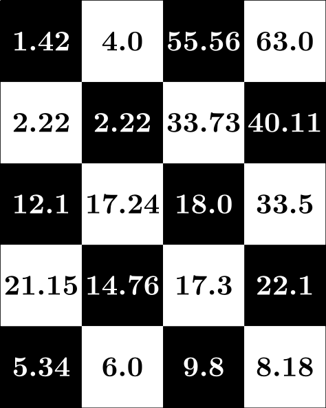

# Exam 2023 Fall - With Solutions

| **Course name:**     | Computer programming        |
|----------------------|-----------------------------|
| **Course number:**   | 02002 and 02003             |
| **Exam date:**       | 6th of December 2023        |
| **Aids allowed:**    | All aids, no internet       |
| **Exam duration:**   | 4 hours                     |
| **Weighting:**       | All tasks have equal weight |
| **Number of tasks:** | 10                          |


## Exam Instructions (as given on the exam day)

### Prerequisites

To be able to solve the exam tasks, you need to have a computer with Python, VSCode, course toolbox, and software packages installed.

### Exam Material

The exam material consists of:

- The exam text as a PDF document `exam2023fall_English.pdf` (this document) and the same document but in Danish `exam2023fall_Danish.pdf`.
- The download script `download_exam2023fall.py`.

You should save the download script, open it in VSCode, and run it. The script will create the files and folders that you need to solve the exam tasks, similar to how weekly exercises, projects, and midterm exam were created. The download script will create the following folders and files:

- A tasks folder `02002students/cp/exam2023fall/tasks/` containing one Python file for each task, serving as a template for the code you need to write. An exception is Task 10, which is in the same file as Task 7.
- A project folder `02002students/cp/exam2023fall/project/` containing one Python file for testing and one Python file for grading your solutions.

If the download script encounters a problem and cannot find the `02002students` folder, it will create the files and folders in the location of the download script.

### Solving Exam Tasks

When solving exam tasks, follow the instructions from the exam text and complete the provided Python files from the tasks folder. You can test your solutions by running the provided testing script `exam2023fall_tests.py`, which tests your solution on a small number of test cases. Solving the tasks and using the testing script is similar to how you have solved weekly exercises and projects. However, for the exam, additional test cases will be used during the evaluation after the exam.

If you believe there is a mistake or ambiguity in the text, you should use the most reasonable interpretation of the text to solve the task to the best of your ability. If we, after the exam, find inconsistencies in one or more tasks, this will be taken into account in the assessment.

### Handing in the Solution

To hand-in your solution, generate a token file by running the provided grading script `exam2023fall_grade.py`. Upload the token file to the [digital exam system](https://eksamen.dtu.dk/) as the main document. Additionally, as an extra assurance, submit your Python solutions. That is, submit the completed Python files from the task folder as attachments in the digital exam system. We will use the Python files if we encounter problems with the token file.

You should thus submit the following file as the main document:

- `Exam2023Fall_handin_xx_of_100.token` (where `xx` is your current score)

and the following files as attachments:

- `arrival_times.py`
- `bank_account.py`
- `checkerboard_sum.py`
- `collatz_conjecture.py`
- `event_probability.py`
- `nitrate_levels.py`
- `phonebook_merge.py`
- `punctuation_ratio.py`
- `special_occurrence.py`

## Task 1: Event Probability

When describing extreme events, such as major earthquakes, landslides, and floods, we utilize the concept of a *return period* $T$, given in years. For example, a flood with a return period of 100 years, referred to as a *100-year flood*, is a flood that has a probability of $\frac{1}{100}$ of occurring in any given year. The probability that an event with a return period $T$ will occur within a period of $n$ years can be expressed as

$$
P = 1-\left(1-{\frac  {1}{T}}\right)^{n}.
$$

You should write a function that takes as input two numbers: the return period `T` (in years) and the period `n` (also in years). The function should return the probability of an event with a return period occurring during the given period.

As an example, consider the input:

```pycon
>>> event_probability(100, 25)
0.22217864060085335
```

The probability that the 100-year event will occur in a period of 25 years is

$$
P = 1-\left(1-{\frac  {1}{100}}\right)^{25}
$$

which is what your function should return, as seen in the example above.

The provided Python file is:
`cp/exam2023fall/tasks/event_probability.py`.

The specifications are:

### cp.exam2023fall.tasks.event_probability.event_probability(T, n)

Return the event probability.

* **Parameters:**
  * **T** (`int`) – A positive integer, the return period.
  * **n** (`int`) – A positive integer, the time period.
* **Return type:**
  `float`
* **Returns:**
  The probability that an event with return period T will occur in the time period.

### Solution

A file with the following content would be a correct solution for the task:

```python
"""Task 1: Event probability."""

def event_probability(T: int, n: int) -> float:
    """Return the event probability.

    :param T: A positive integer, the return period.
    :param n: A positive integer, the time period.
    :return: The probability that an event with return period T will occur in the time period.
    """
    return 1 - (1 - (1 / T)) ** n
```

## Task 2: Arrival Times

Given a list of scheduled train arrivals (hours and minutes) and a delay in minutes, we need to determine the expected arrival times. The scheduled times are given as a list of strings. Each time is formatted as **hh:mm** for a 24-hour display. Here, **hh** is the number of hours between 00 and 23 written using two digits, while **mm** is the number of minutes between 00 and 59 written using two digits. Expected arrival times need to be formatted in the same way.

Write a function that takes as input a list of scheduled arrivals and a delay in minutes. The list may contain an arbitrary number of scheduled arrivals, but the delay is the same for all arrivals. The function should return a list of strings with expected arrival times formatted as **hh:mm** in 24-hour time notation with two digits for both hours and minutes. Remember to handle the case when the delay causes the arrival to be postponed until the next day.

As an example, consider the input:

```pycon
>>> arrival_times(['12:37', '08:10'], 25)
['13:02', '08:35']
```

The first scheduled arrival is **12:37**. However, with a 25-minute delay, the expected arrival is **13:02**.
The second scheduled arrival is **08:10**, but with a 25-minute delay, the expected arrival is **08:35**.

The provided Python file is:
`cp/exam2023fall/tasks/arrival_times.py`.

The specifications are:

### cp.exam2023fall.tasks.arrival_times.arrival_times(schedule, delay)

Return the arrival times given scheduled times and delay.

* **Parameters:**
  * **schedule** (`list`) – A list of strings, the scheduled times.
  * **delay** (`int`) – A positive integer, the delay (in minutes).
* **Return type:**
  `list`
* **Returns:**
  The arrival times, a list of strings.

### Solution

A file with the following content would be a correct solution for the task:

```python
"""Task 2: Arrival times."""

def arrival_times(schedule: list, delay: int) -> list:
    """Return the arrival times given scheduled times and delay.

    :param schedule: A list of strings, the scheduled times.
    :param delay: A positive integer, the delay (in minutes).
    :return: The arrival times, a list of strings.
    """
    actual = []
    for time in schedule:
        h, m = time.split(':')
        m = int(m) + delay
        h = (int(h) + m // 60) % 24
        m = m % 60
        actual.append(f'{h:02}:{m:02}')
    return actual
```

## Task 3: Special Occurrence

Given a sequence of positive integers, we want to find what we call a *special occurrence*. A special occurrence is when the number **5** is followed by two numbers where *exactly* one is **7**. Thus the occurrence **…5, 3, 7…** is a special occurrence, and so is the occurrence **…5, 7, 8…**, while **…5, 7, 7…** is *not* a special occurrence.

Write a function that takes as input a list of positive integers. The function should return the index of the number **5** in the first special occurrence. If no such occurrence exists, the function should return **-1**.

As an example, consider the input:

```pycon
>>> special_occurrence([2, 8, 11, 3, 12, 5, 7, 7, 11, 3, 12, 5, 2, 7, 5, 7, 2, 6])
11
```

The number **5** occurs three times in the sequence, at positions with index **5**, **11**, and **14**. The first occurrence of the number **5** is not a special occurrence as it is followed by *two* **7**. The second occurrence is a special occurrence as it is followed by **2** and **7**. The third occurrence is a special occurrence, but it occurs later than the second occurrence. Therefore, the function should return **11**.

The provided Python file is:
`cp/exam2023fall/tasks/special_occurrence.py`.

The specifications are:

### cp.exam2023fall.tasks.special_occurrence.special_occurrence(sequence)

Find first special occurrence.

* **Parameters:**
  **sequence** (`list`) – A list of positive integers with 0 or more elements.
* **Return type:**
  `int`
* **Returns:**
  The index of the first 5 followed by two numbers where exactly one is 7.

### Solution

A file with the following content would be a correct solution for the task:

```python
"""Task 3: Special occurrence."""

def special_occurrence(sequence: list) -> int:
    """Find first special occurrence.

    :param sequence: A list of positive integers with 0 or more elements.
    :return: The index of the first 5 followed by two numbers where exactly one is 7.
    """
    for i in range(len(sequence) - 2):
        if (sequence[i]==5) and (((sequence[i+1]==7) + (sequence[i+2]==7))==1):
            return(i)
    return(-1)
```

## Task 4: Punctuation Ratio

We would like to collect statistics about using commas in connection with the word **and**. Therefore, given a text, we first want to identify all occurrences of the lower-case word **and** between two spaces, that is the string
`" and "`. Then, we want to calculate the ratio of the cases where a comma immediately precedes `" and "` against the cases without the comma (that is, any other character immediately precedes `" and "`). The ratio should be given as

$$
\text{ratio}  = \frac{\text{number of cases with a comma before " and "}}{\text{number of cases without a comma before " and "}}.
$$

Write a function that takes a string with text as input. The function should return a number giving the ratio of occurrences of `" and "` preceded by a comma against the occurrences of `" and "` not preceded by a comma. You can assume that the text does not start with `" and "`. If either the numerator or the denominator is zero, the function should return **0**.

Consider the input:

```pycon
>>> text = ("Sara and Emma like to travel, bike, and hike, and when they are " +
...     "traveling they always take their bikes, hiking shoes, and sleeping bags. " +
...     "Last year, Sarah and Emma traveled to Italy, France, and Spain. And that " +
...     "was fun, and, according to Sara and Emma, very expensive!")
>>> punctuation_ratio(text)
1.3333333333333333
```

Consider now all seven occurrences of `" and "`, highlighted in the following text:

> Sara **and** Emma like to travel, bike, **and** hike, **and** when they are traveling they always take their bikes, hiking shoes, **and** sleeping bags. Last year, Sarah **and** Emma traveled to Italy, France, **and** Spain. And that was fun, and, according to Sara **and** Emma, very expensive!

The string `" and "` is not preceded by a comma three times (in the phrase *Sarah and Emma*), while it is preceded by a comma four times (all other occurrences). The ratio we should compute is therefore 4/3, and this is what your function should return, as seen in the example above.

The provided Python file is:
`cp/exam2023fall/tasks/punctuation_ratio.py`.

The specifications are:

### cp.exam2023fall.tasks.punctuation_ratio.punctuation_ratio(text)

Return punctuation ratio.

* **Parameters:**
  **text** (`str`) – A string with some text.
* **Return type:**
  `float`
* **Returns:**
  Ratio of \` and \` preceded by comma against \` and \` not preceded by comma.

### Solution

A file with the following content would be a correct solution for the task:

```python
"""Task 4: Punctuation ratio."""

def punctuation_ratio(text: str) -> float:
    """Return punctuation ratio.

    :param text: A string with some text.
    :return: Ratio of ` and ` preceded by comma against ` and ` not preceded by comma.
    """
    words = text.split()

    with_comma = 0
    without_comma = 0
    for i in range(1, len(words)):
        if words[i] == 'and':
            if words[i - 1][-1] == ',':
                with_comma += 1
            else:
                without_comma += 1

    if with_comma * without_comma == 0:
        return 0
    return with_comma/without_comma
```

## Task 5: Checkerboard Sum

Given a 2D NumPy array, we want to compute the sum of all elements occurring in a checkerboard pattern of arbitrary size.
Consider the following 2D array arranged in a checkerboard pattern:



Write a function which takes as input a 2D NumPy array. The function should return the sum of all elements in the black squares of the checkerboard pattern. The square in the first row and the first column is always black.

Consider the input:

```pycon
>>> import numpy as np
>>> A = np.array([[ 1.42,  4.0,  55.56, 63.0],
...               [ 2.22,  2.22, 33.73, 40.11],
...               [12.1,  17.24, 18.0,  33.5],
...               [21.15, 14.76, 17.3,  22.1],
...               [ 5.34,  6.0,   9.8,   8.18]])
>>> checkerboard_sum(A)
181.41
```

The sum of all elements occurring in a checkerboard pattern on the black squares is

$$
1.42 + 55.56 + 2.22 + 40.11 + 12.1 + 18.0 + 14.76 + 22.1 + 5.34 + 9.8 = 181.41
$$

and this is what your function should return.

The provided Python file is:
`cp/exam2023fall/tasks/checkerboard_sum.py`.

The specifications are:

### cp.exam2023fall.tasks.checkerboard_sum.checkerboard_sum(A)

Return checkerboard sum.

* **Parameters:**
  **A** (`ndarray`) – A 2D NumPy array.
* **Return type:**
  `float`
* **Returns:**
  The sum of elements in checkerboard pattern.

### Solution

A file with the following content would be a correct solution for the task:

```python
"""Task 5: Checkerboard sum."""

import numpy as np

def checkerboard_sum(A: np.ndarray) -> float:
    """Return checkerboard sum.

    :param A: A 2D NumPy array.
    :return: The sum of elements in checkerboard pattern.
    """
    return A[::2,::2].sum() + A[1::2,1::2].sum()
```

## Task 6: Collatz Conjecture

The Collatz conjecture is an unsolved problems in mathematics.
One step of the Collatz conjecture is defined as

$$
f(n) = \left\{
    \begin{array}{}
    n/2 & \text{if $n$ is even} \\
    3n+1 & \text{if $n$ is odd}
    \end{array}
\right.
$$

The conjecture states that for any positive integer $n$, the sequence $n, \, f(n), \, f(f(n)), \, f(f(f(n))), \, \ldots$ will reach the number 1, but whether the conjecture is true has not yet been proven or disproven.

Write a function that takes as input a positive integer `n`. The function should return the number of steps required to reach the number 1.

Consider the input:

```pycon
>>> collatz_conjecture(3)
7
```

Since $3$ is an odd number, the next number in the sequence is $3 \cdot 3 + 1=10$. This is an even number, so the next number in the sequence is  $10/2=5$. The full sequence is $3, 10, 5, 16, 8, 4, 2, 1$, and it took $7$ steps to reach the number $1$.

The provided Python file is:
`cp/exam2023fall/tasks/collatz_conjecture.py`.

The specifications are:

### cp.exam2023fall.tasks.collatz_conjecture.collatz_conjecture(n)

Return the number of steps to reach 1 in the Collatz conjecture.

* **Parameters:**
  **n** (`int`) – A positive integer, the starting number.
* **Return type:**
  `int`
* **Returns:**
  A positive integer, the number of steps.

### Solution

A file with the following content would be a correct solution for the task:

```python
"""Task 6: Collatz conjecture."""

def collatz_conjecture(n: int) -> int:
    """Return the number of steps to reach 1 in the Collatz conjecture.

    :param n: A positive integer, the starting number.
    :return: A positive integer, the number of steps.
    """
    count = 0
    while n > 1:
        if n%2 == 0:
            n = n//2
        else:
            n = 3 * n + 1
        count += 1
    return count
```

## Task 7: Bank Account

We want to create a class to represent a bank account, allowing for depositing and withdrawing money while ensuring the balance never goes negative.

Write the class definition for the class `BankAccount`. The balance must be stored in an attribute called `balance`. The `__init__` method should take the initial balance as input.
The `deposit` method should take as input an amount to deposit and add it to the balance.
The `withdraw` method should take as input an amount to withdraw and subtract it from the balance.
If the withdrawal would result in a negative balance, the method should print `Withdraw failed: Insufficient funds` and leave the balance unchanged.
The `print_balance` method should print the balance, e.g., for a balance of 1300 it should print `Balance: 1300 DKK`.

Here is an example of using the class:

```pycon
>>> my_account = BankAccount(1000)
>>> my_account.print_balance()
Balance: 1000 DKK
>>> my_account.deposit(500)
>>> my_account.print_balance()
Balance: 1500 DKK
>>> my_account.withdraw(200)
>>> my_account.print_balance()
Balance: 1300 DKK
>>> my_account.withdraw(2000)
Withdraw failed: Insufficient funds
>>> my_account.print_balance()
Balance: 1300 DKK
```

The balance is 1000 initially. Then, 500 is deposited. Next, 200 is withdrawn, which is allowed since the balance before withdrawing is 1500. Finally, an attempt to withdraw 2000 is made, but since the current balance is only 1300, the withdrawal is not possible. The message is printed, and the balance remains unchanged.

The Python file provided for this task and for Task 10 is:
`cp/exam2023fall/tasks/bank_account.py`.
For this task, you should only modify the definition of `BankAccount`. The second part of this file is used in Task 10.

The specifications are:

### *class* cp.exam2023fall.tasks.bank_account.BankAccount(balance)

A class that represents a bank account.

#### \_\_init_\_(balance)

Initialize the bank account with a balance.

* **Parameters:**
  **balance** (`int`) – Non-negative; the initial balance of the bank account.

#### deposit(amount)

Deposit money into the account.

* **Parameters:**
  **amount** (`int`) – Positive; The amount of money to deposit.

#### withdraw(amount)

Withdraw money from the account.
If withdrawal fails, print “Withdraw failed: Insufficient funds”.

* **Parameters:**
  **amount** (`int`) – Positive; The amount of money to withdraw.

#### print_balance()

Print the balance of the bank account, formatted for Danish currency.

### Solution

A file with the following content would be a correct solution for the task:

```python
"""Task 7: Bank account."""

class BankAccount():
    """A class that represents a bank account."""
    def __init__(self, balance):
        self.balance = balance

    def deposit(self, amount):
        self.balance += amount

    def withdraw(self, amount):
        if amount <= self.balance:
            self.balance -= amount
        else:
            print('Withdraw failed: Insufficient funds')

    def print_balance(self):
        print(f'Balance: {self.balance} DKK')
```

## Task 8: Phonebook Merge

A phonebook is represented as a dictionary where each key corresponds to a contact’s name, and the corresponding value is a list of phone numbers associated with that contact. Both the names and phone numbers are strings. Given a second phonebook, we want to add its content to the first phonebook, but without creating duplicates.

Write a function that takes two dictionaries representing phonebooks as input. The function should not have a return statement, but it should *modify* the first phonebook by adding the content from the second phonebook. Specifically:

1. If a name from the second phonebook is not present in the first phonebook, it should be added to the first phonebook along with its associated phone numbers.
2. If a name from the second phonebook is already present in the first phonebook, then we look at the two lists of phone numbers for that name. Phone numbers that are only present in the second list should be appended to the first list in the order they occur in the second list.

Consider the input:

```pycon
>>> phonebook = {'Liv': ['55511112', '18777890'] ,
...              'Mads': ['27274445', '48533336'],
...              'Steve': ['45455555', '25455525']}
>>>
>>> second_phonebook = {'Anna': ['89577772'] ,
...                     'Steve': ['25257755', '25455525'],
...                     'Mads': ['48533336', '27274445']}
>>>
>>> phonebook_merge(phonebook, second_phonebook)
>>> for name in phonebook:
...     print(name, phonebook[name])
...
Liv ['55511112', '18777890']
Mads ['27274445', '48533336']
Steve ['45455555', '25455525', '25257755']
Anna ['89577772']
```

Consider the elements of `second_phonebook`. The name **Anna** is not present in `phonebook`, so it should be added along with its associated phone numbers. The name **Steve** is already present in `phonebook`, and the phone numbers from `second_phonebook` include a new number **45455555**, which should be appended to the list of phone numbers for **Steve**. The name **Mads** is already present in `phonebook`, and `second_phonebook` does not provide any new phone numbers for **Mads**, so there is nothing to add.

The provided Python file is:
`cp/exam2023fall/tasks/phonebook_merge.py`.

The specifications are:

### cp.exam2023fall.tasks.phonebook_merge.phonebook_merge(phonebook, second_phonebook)

Modify phonebook by adding new content from second_phonebook.

* **Parameters:**
  * **phonebook** (`dict`) – Dictionary with names and list of phone numbers.
  * **second_phonebook** (`dict`) – Dictionary with names and list of phone numbers.

### Solution

A file with the following content would be a correct solution for the task:

```python
"""Task 8: Phonebook merge."""

def phonebook_merge(phonebook: dict, second_phonebook:dict):
    """Modify phonebook by adding new content from second_phonebook.

    :param phonebook: Dictionary with names and list of phone numbers.
    :param second_phonebook: Dictionary with names and list of phone numbers.
    """
    for key in second_phonebook:
        if key in phonebook:
            for nr in second_phonebook[key]:
                if nr not in phonebook[key]:
                    phonebook[key].append(nr)
        else:
            phonebook[key] = second_phonebook[key]
```

## Task 9: Nitrate Levels

Once a week, samples of drinking water are tested for nitrate. The test results are stored in a file where each line contains a floating-point number representing one nitrate level measurement. Nitrate levels are categorized as:

{\\vspace{4pt}\\setlength{\\parskip}{0pt}
- **Very low**: Nitrate levels less than or equal to 4.0 mg/l.
- **Low**: Nitrate levels above 4.0 but less than or equal to 9.0 mg/l.
- **Normal**: Nitrate levels above 9.0 and below 40.0 mg/l.
- **High**: Nitrate levels greater than or equal to 40.0 but below 50.0 mg/l.
- **Very high**: Nitrate levels greater than or equal to 50.0 mg/l.

}

Note here that when the nitrate level falls on the border between two categories, it is included in the category further from normal. For example, a nitrate level of 4.0 mg/l is **very low**, and a nitrate level of 40.0 mg/l is **high**.

Write a function that takes a string containing the file name with the nitrate levels as input. The function should return the number of weeks where the nitrate levels were very low, low, normal, high, and very high, respectively, as shown in the example below.

Consider the file:

```pycon
>>> filename = 'cp/exam2023fall/tasks/files/nitrate_data_A.txt'
```

The path is given relative to `02002students` folder, and the file has the contents as shown below.

```pycon
34.5
34.9
36.7
29.9
34.5
44.5
34.5
46.5
29.9
34.5
```

Consider now giving the filename of this file as input to the function:

```pycon
>>> very_low, low, normal, high, very_high = nitrate_levels(filename)
>>> print(very_low, low, normal, high, very_high)
0 0 8 2 0
```

None of the values are below 9.0, so none belong to the lower two categories. Eight values are in the range from 9.0 to 40.0, classifying them as normal. Two values are between 40.0 and 50.0, placing them in the high category. There are no values that are classified as very high. The function therefore returns 0, 0, 8, 2, 0.

The provided Python file is:
`cp/exam2023fall/tasks/nitrate_levels.py`.

The specifications are:

### cp.exam2023fall.tasks.nitrate_levels.nitrate_levels(filename)

Return the number of weekly measurements in each category.

* **Parameters:**
  **filename** (`str`) – Filename of the data file.
* **Return type:**
  (`int`, `int`, `int`, `int`, `int`)
* **Returns:**
  Number of measurements in each of five categories for nitrate levels.

### Solution

A file with the following content would be a correct solution for the task:

```python
"""Task 9: nitrate levels."""

def nitrate_levels(filename: str) -> (int, int, int, int, int):
    """Return the number of weekly measurements in each category.

    :param filename: Filename of the data file.
    :return: Number of measurements in each of five categories for nitrate levels.
    """
    very_low = 0
    low = 0
    normal = 0
    high = 0
    very_high = 0

    with open(filename) as f:
        for line in f:
            value = float(line)
            if value <= 4.0:
                very_low += 1
            elif value <= 9.0:
                low += 1
            elif value < 40:
                normal += 1
            elif value < 50:
                high += 1
            else:
                very_high += 1

    return very_low, low, normal, high, very_high
```

## Task 10: Overdraft Account

We want to create a subclass of the `BankAccount` class from Task 7. This subclass should allow the user to have a negative balance, as long as the sum of the balance and the overdraft limit is not negative.

Write the class definition for the subclass `OverdraftAccount`, which inherits from `BankAccount`. Each instance of the subclass should store the overdraft limit. The constructor of the new class should take as input the initial balance and the overdraft limit (a non-negative integer). The withdraw method should ensure that the overdraft limit is not exceeded. If the withdrawal is not possible, the balance should remain unchanged, and the method should print `Withdraw failed: Overdraft limit exceeded`. You should modify the necessary methods of the class to achieve this behavior, and inherit the rest of the methods from the parent class.

An example of using the class is:

```pycon
>>> my_account = OverdraftAccount(0, 500)
>>> my_account.print_balance()
Balance: 0 DKK
>>> my_account.deposit(1000)
>>> my_account.print_balance()
Balance: 1000 DKK
>>> my_account.withdraw(1300)
>>> my_account.print_balance()
Balance: -300 DKK
>>> my_account.withdraw(500)
Withdraw failed: Overdraft limit exceeded
>>> my_account.print_balance()
Balance: -300 DKK
```

Here, the initial balance is 0, and the overdraft limit is 500. First, 1000 is deposited. Then, 1300 is withdrawn. This is allowed since it brings the balance to -300 which is above -500. Finally, 500 is attempted to be withdrawn, but that would bring the balance below -500. So, this withdrawal is not possible, the message is printed, and the balance remains unchanged.

The provided Python file is the same as for Task 7:
`cp/exam2023fall/tasks/bank_account.py`.
For this task, you should only modify the definition of class `OverdraftAccount`.

The specifications are:

### *class* cp.exam2023fall.tasks.bank_account.OverdraftAccount(balance, overdraft_limit)

A class that represents a bank account allowing overdraft.

#### \_\_init_\_(balance, overdraft_limit)

Initialize the overdraft account with a balance and a overdraft limit.

* **Parameters:**
  * **balance** (`int`) – Non-negative; The initial balance of the bank account.
  * **overdraft_limit** (`int`) – Non-negative; The overdraft limit of the bank account.

#### withdraw(amount)

Withdraw money from the bank account.
If the withdrawal fails, the following message should be printed:
“Withdraw failed: Overdraft limit exceeded”.

* **Parameters:**
  **amount** (`int`) – Positive; The amount of money to withdraw.

### Solution

A file with the following content would be a correct solution for the task:

```python
"""Task 7: Bank account."""

class BankAccount():
    """A class that represents a bank account."""
    def __init__(self, balance):
        self.balance = balance

    def deposit(self, amount):
        self.balance += amount

    def withdraw(self, amount):
        if amount <= self.balance:
            self.balance -= amount
        else:
            print('Withdraw failed: Insufficient funds')

    def print_balance(self):
        print(f'Balance: {self.balance} DKK')


"""Task 10: Overdraft account."""

class OverdraftAccount(BankAccount):
    """A class that represents a bank account allowing overdraft."""
    def __init__(self, balance, overdraft_limit):
        super().__init__(balance)
        self.overdraft_limit = overdraft_limit

    def withdraw(self, amount):
        if amount <= self.balance + self.overdraft_limit:
            self.balance -= amount
        else:
            print('Withdraw failed: Overdraft limit exceeded')

```
